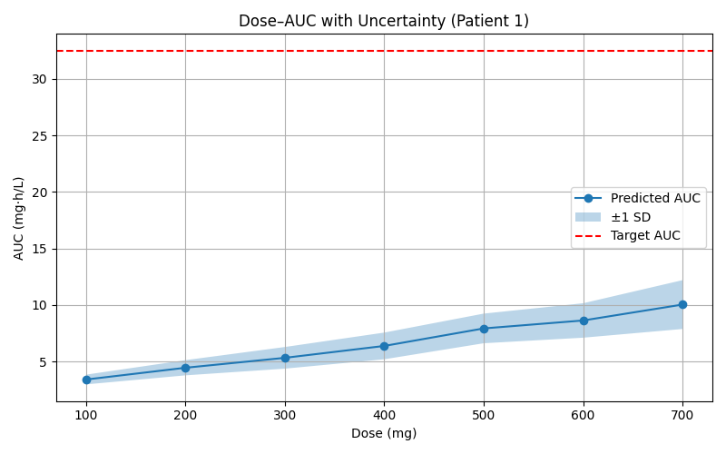
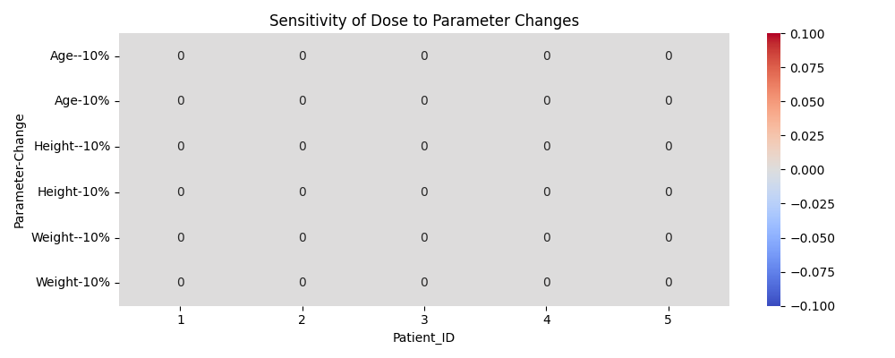

# 🧠 Dose Optimization Using PK Simulation and Neural Network Surrogate

This project presents a precision dosing framework for **Imatinib** using a two-compartment **pharmacokinetic (PK) model** (Yi-Han Chien et al.) combined with a **neural network (NN) surrogate model** to predict patient-specific dose–AUC relationships.

The goal is to develop a **clinically usable AI tool** to recommend individualized doses with uncertainty estimation.

---

## 📂 Repository Contents

* `pk_model.py`: PK simulation model using a transit-absorption two-compartment approach
* `full_dose_auc_pipeline.py`: Neural network training, AUC prediction, and uncertainty analysis
* `dose_auc_simulated_data.csv`: Simulated dose–AUC dataset from the PK model
* `summary_exposure_metrics.csv`: Derived AUC summaries used for training
* `virtual_patient_dose_predictions.csv`: Recommended doses for 5 virtual patients
* `dose_sensitivity_analysis.csv`: Sensitivity analysis results
* `summary_dose_recommendations_table.png`: AUC prediction summary image (for manuscript)
* `dose_auc_uncertainty_patient1.png`: Dose–AUC curve with uncertainty for Patient 1
* `requirements.txt`: Required Python packages
* `LICENSE`: MIT open-source license

---

## 🎯 Target AUC

> The clinical target AUC for Imatinib is **\~32.5 mg·h/L**, based on published therapeutic window studies.

The neural network is trained to recommend the dose that most closely achieves this target AUC for any given patient.

---

## 🚀 How to Use

### 1. Clone the Repository

```bash
!git clone https://github.com/muthukumar1197/imatinib-dose-optimizer.git
%cd imatinib-dose-optimizer
```

### 2. Install Dependencies

```bash!pip install -r requirements.txt
```

### 3. Run the PK Simulation (Optional)

```bash
!python pk_model.py  # generates dose_auc_simulated_data.csv
```

### 4. Train the Neural Network and Perform Analysis

```bash
!python Neural Network.py
```

---

## 📊 Sample Output

* **Virtual Patient Dose Recommendations:**
  See `virtual_patient_dose_predictions.csv`

* **Uncertainty Visualization:**
  

* **Sensitivity Heatmap:**
  

---

## 📚 Citation

If you use this project in your work, please cite the forthcoming paper:

> Muthukumar et al. *A Neural Network Surrogate Model for Simulated Pharmacokinetics in Individualized Imatinib Dosing*, submitted to Acta Materia Medica, 2025.

---

## 🚪 License

This project is licensed under the [MIT License](LICENSE).

---

## 💬 Questions or Contributions?

Feel free to [open an issue](https://github.com/muthukumar1197/imatinib-dose-optimizer/issues) or reach out!

---

🎓 Built with ❤️ for AI-powered precision medicine.
